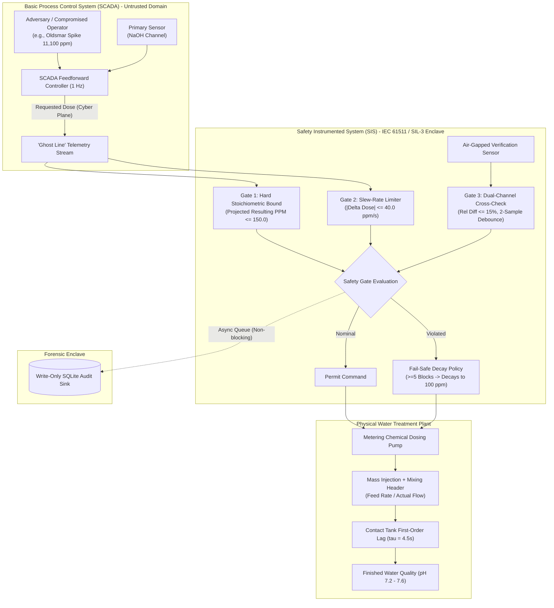

# Oldsmar SCADA Defense: System Design & Judge Pitch Guide

This guide provides the strategic pitch angle, core engineering dilemma, system design highlights, and a structured pitch script tailored for hackathon judges evaluating the **Oldsmar SCADA Chemical Dosing Safety Interlock** system.

---

## 1. The Core Critical Problem

### "The Cyber-Physical Trust Dilemma: Authorized Commands with Catastrophic Physics"

In traditional enterprise IT security, defensive mechanisms focus on identity, authentication, and boundary encryption (firewalls, passwords, PKI, 2FA). However, in **Industrial Control Systems (ICS) and SCADA environments**, these traditional assumptions fall apart:

1. **The Attacker Operates from Within the Trust Boundary:**
   - In the real February 2021 Oldsmar, Florida attack, an external adversary accessed the plant via remote software (TeamViewer) using compromised operator credentials.
   - To the control network, firewalls, and application servers, the malicious command is **100% authorized, authenticated, and valid**.
2. **Controllers Lack Inherent Physical Awareness:**
   - Standard Programmable Logic Controllers (PLCs) execute instructions blindly. When presented with a setpoint of `11,100 ppm`, the controller runs the dosing pump motor without evaluating the downstream thermodynamic or chemical consequences.
3. **The Safety vs. Availability Paradox:**
   - In municipal critical infrastructure, software cannot simply crash or trigger an emergency shutdown (E-stop) at the first sign of noise. A hard plant shutdown drops municipal water pressure, collapsing city firefighting capabilities and drawing contaminated groundwater into drinking mains via negative pressure back-siphonage.
   - Conversely, failing to block malicious commands distributes corrosive sodium hydroxide (pH 12.8+ lye) directly into household taps.

> **The Fundamental Question:**
> *How do you build a deterministic, independent safety layer that enforces immutable physical laws and maintains drinking water availability, even when the human operator, the network, and the SCADA server are fully compromised?*

---

## 2. Key System Design Concepts to Pitch to Judges

### 1. Decoupled BPCS vs. SIS Architecture (IEC 61511 / SIL-3 Compliance)
- **Concept:** Strict operational separation between the **Basic Process Control System (BPCS)** and the **Safety Instrumented System (SIS)**.
- **Judge Value:** Demonstrates compliance with real industrial standards (IEC 61511 / ISA-84). The safety interlock does not run inside the SCADA web server; it represents an independent, out-of-band logic solver. Even complete administrative takeover of the SCADA layer cannot bypass the physical gates.

### 2. Physics-Based Stoichiometric Invariants (Neutralizing Flow Spoofing)
- **Concept:** Rather than merely checking raw actuator metrics (motor RPM, stroke percentage, or nominal setpoints), the interlock projects downstream physical concentration:
  $$\text{Resulting Concentration (ppm)} = \frac{\text{Chemical Feed Mass Rate (mg/s)}}{\text{Water Flow Rate (L/s)}}$$
- **Judge Value:** Protects against indirect attacks. If an adversary leaves chemical dosing alone and instead spoofs the water flow meter to `15 L/s`, a naive controller would overdose the water to compensate. The interlock halts this because it models finished-water chemistry.

### 3. Graceful Degradation via Fail-Safe Decay Policy
- **Concept:** Solving the Safety vs. Availability dilemma:
  - **Transient Blocks (Ticks 1–4):** Holds the last accepted safe dose to ride through transient sensor noise and debounce anomalies without interrupting service.
  - **Sustained Compromise (Ticks 5+):** Activates an exponential decay filter that systematically steps down chemical injection toward the nominal safe baseline (`100.0 ppm`).
- **Judge Value:** Demonstrates operational resilience. The plant avoids abrupt shutdowns while preventing runaway chemical accumulation.

### 4. Dual-Channel Analytic Redundancy & Debounce Filtering
- **Concept:** SCADA operations rely on the Primary Sensor channel, while the safety interlock independently interrogates a secondary Verification Sensor.
- **Judge Value:** Flags discrepancies exceeding 15% with a 2-sample debounce filter. This eliminates false alarms from acoustic sensor noise while immediately intercepting stealth manipulation attacks.

### 5. "The Ghost Line" Dual-Plane Telemetry & Write-Isolated Audit Sink
- **Concept:**
  - **Dual-Plane Visualization:** Real-time visual distinction between the adversary's *Cyber Command* (the dashed red "Ghost Line") and the plant's *Physical Actuation* (the solid cyan line).
  - **Isolated Audit Sink:** Append-only SQLite telemetry recording runs in an asynchronous worker thread, ensuring forensic preservation without impacting 1Hz real-time loop deadlines.

---

## 3. 90-Second Hackathon Judge Pitch Script

### [0:00 - 0:15] The Hook
> *"In February 2021, an attacker accessed the water treatment plant in Oldsmar, Florida via remote desktop and altered the sodium hydroxide dosing from 100 ppm to 11,100 ppm—turning drinking water into caustic drain cleaner. The city avoided disaster only because an operator happened to watch their mouse move on screen. We asked: why was a software command allowed to poison a municipal water supply in the first place?"*

### [0:15 - 0:35] The Real Problem
> *"In SCADA and critical infrastructure, conventional IT security fails because the attacker uses valid operator credentials. To the network, the command looks legitimate. PLCs execute setpoints without understanding physical chemistry. Worse, you can't simply halt the plant on an error, because dropping water pressure compromises firefighting and causes groundwater back-siphonage."*

### [0:35 - 1:05] The Solution & System Architecture
> *"We built an IEC 61511-compliant Safety Instrumented Interlock that acts as an independent guardian between the SCADA control network and the chemical pumps. It enforces three concentric physical gates:
> 1. A stoichiometric hard ceiling on actual finished-water concentration,
> 2. A slew-rate acceleration limiter, and
> 3. Dual-channel analytic sensor redundancy.
> Crucially, we designed an automated **Fail-Safe Decay Policy**: under sustained attack, the system does not crash or shut down; it smoothly decays chemical dosing back to the safe 100 ppm baseline."*

### [1:05 - 1:30] The Live Demonstration
> *"Look at the control console:
> - **First, Interlock Bypassed:** We fire the Oldsmar spike. The pump obeys, and over 20 seconds our contact tank pH climbs into the lethal red zone at 12.8.
> - **Now, Interlock Engaged:** We trigger the exact same attack. Notice the **'Ghost Line'**—the requested dose shoots to 11,100 ppm, but the physical pump stays locked, our fail-safe decay maintains 100 ppm, and the finished water stays safe at pH 7.60."*

---

## 4. Judge Q&A Preparation

| Question | Defensible Answer |
|---|---|
| **"What stops the hacker from calling the API to turn off the interlock?"** | *"In industrial standards (IEC 61511 / ISA-84), Safety Instrumented Systems are physically air-gapped from SCADA and run on dedicated SIL-3 rated hardware (like Triconex logic solvers). The ON/OFF switch in our interface is a demonstration stand-in for a physical, key-operated lock switch on the equipment cabinet, not a software API exposed to the network."* |
| **"Why not simply freeze the last good dose forever when an attack is detected?"** | *"If the plant happened to be operating at an elevated setpoint (e.g. 140 ppm) when the attack started, freezing that state indefinitely reduces operating margins. Our Fail-Safe Decay actively steps the plant down toward the ideal 100 ppm baseline after 5 consecutive blocks."* |
| **"Why check concentration instead of raw pump stroke?"** | *"If an attacker tampers with the water flow meter, reporting 15 L/s instead of 50 L/s, a controller checking raw pump displacement would still cause an overdose. By calculating projected resulting concentration, our interlock remains immune to flow sensor falsification."* |
