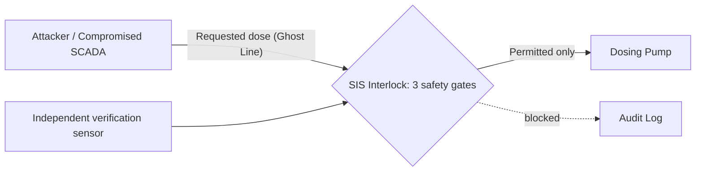

# Presentation Outline — AquaLock SIS (5-minute pitch)

This is the working script for turning our slides into the final deck. Slide numbers match `docs/PUREIT_Presentation.pptx` (8 slides) so we can edit that file directly from this markdown. Content is cross-checked against `README.md`, `SYSTEM_DESIGN_AND_PITCH.md`, `docs/SYSTEM_EXPLAINED.md`, `docs/DEMO_ATTACK_API.md`, and `docs/Teamsheet.md`.

## Corrections made vs. the current pptx

- **Project name**: pptx slide 1 still says "AQUAPHY". Every other doc (README, Teamsheet) uses **AquaLock SIS** — updated throughout below.
- **Team member name mismatch**: pptx slide 1 has "Amaan Rais Shah"; `Teamsheet.md` has "Amaan Rais". Kept the fuller pptx version here since the other three names were already expanded to full legal names in the Teamsheet — **please confirm which is correct** before final print.
- Everything else in the pptx (thresholds, attack names, next steps, AI disclosure) matches the source docs and needed no factual correction.

## Timing budget — total 4:40, leaving ~20s buffer inside a 5-minute slot

| Slide | Section | Time |
|---|---|---|
| 1 | Title | 0:10 |
| 2 | The threat / who it hurts | 0:45 |
| 3 | Independent safety layer | 0:35 |
| 4 | Three safety gates | 0:35 |
| 5 | Response to sustained attack | 0:25 |
| 6 | Live demonstration | 1:30 |
| 7 | Path to industrial validation | 0:30 |
| 8 | Thank you / repo / AI disclosure | 0:10 |

---

## Slide 1 — Title (0:00–0:10)

- **AquaLock SIS** — Independent safety interlock for water-treatment dosing
- CyberMACS Summer School 2026 Hackathon
- Team PUREIT · Track A — Resilience Under Attack
- Amaan Rais Shah · Amar Kumar Mandal · Mahdi Mohammad Shibli · Quazi Fariha Tasnim · S M Dedar Alam

> "In February 2021, an attacker turned a water plant's drinking water into caustic drain cleaner using nothing but a valid login. We built the thing that should have stopped it."

---

## Slide 2 — The threat to water treatment / who it hurts (0:10–0:55)

- **Who it hurts:** CyberCity's water treatment SCADA operator, on shift when a compromised credential issues a malicious dosing command, and everyone downstream drinking the water.
- Compromised operator credential leads SCADA to accept the command, and the PLC executes the setpoint blindly, with no idea what the chemistry does next.
- Grounded in the real 2021 Oldsmar, FL attack: NaOH dosing spiked from ~100 ppm to ~11,100 ppm before a human operator caught it.
- The catch: you can't just emergency-stop the plant either, since that drops citywide water pressure, kills firefighting capacity, and risks backflow contamination.
- **The jury's actual question, stated up front:** "How do you build an independent safety layer that holds even when the operator, the network, and the SCADA server are all compromised, without sacrificing water availability?"

---

## Slide 3 — An independent safety layer (0:55–1:30)

- We built **AquaLock SIS**: an out-of-band Safety Instrumented System (SIS) sitting between the SCADA loop and the physical dosing pump, modeled on IEC 61511 / ISA-84.
- Even a fully compromised SCADA server can't reach in and touch it. Three independent gates must all pass before a command reaches the pump.

- Say explicitly: this is a prototype interlock. Real hardware isolation and a physical key switch are future work, not achieved certification (avoids overclaiming to the jury).

---

## Slide 4 — Three safety gates (1:30–2:05)

1. **150 ppm concentration ceiling**: caps the *projected finished-water concentration*, not the raw pump stroke, so it also catches flow-sensor spoofing.
2. **40 ppm/s slew-rate limit**: rejects any dose change faster than this outright.
3. **15% dual-channel cross-check**: a second, independent sensor must agree with the primary within 15%, debounced across multiple samples.

- Call out: these are our prototype thresholds, not validated drinking-water limits. Real deployment needs plant-specific safety validation.

---

## Slide 5 — Response to a sustained attack (2:05–2:30)

- After **5 consecutive blocked commands**, a fail-safe decay policy steps dosing smoothly back to the **100 ppm baseline**.
- The point: we don't just slam the plant shut when an attack persists. The plant keeps running while the system self-corrects.

---

## Slide 6 — Live demonstration (2:30–4:00, unrushed)

Follow the 3-phase script in `docs/DEMO_ATTACK_API.md`:

1. **Baseline (about 15s):** interlock ON, reset, show `/state`: pH ~7.60, dose ~100 ppm, `NOMINAL OPERATION`.
2. **Unprotected attack (about 35s):** interlock OFF, fire `oldsmar_spike`. Pump ramps to 11,100 ppm, pH climbs into the red band over ~15–20s. "This is what happens with SCADA alone."
3. **Protected attack (about 40s):** reset, interlock ON, fire `oldsmar_spike` again. Show the dashboard: the dashed red "Ghost Line" (requested dose) rockets up, the solid actual-dose line stays locked near baseline, pH stays ~7.60. Point at the audit log entry showing which gate tripped.

Keep narration tight so the demo itself isn't rushed. This is the moment judges remember.

---

## Slide 7 — Path to industrial validation (4:00–4:30)

- Replace simulated sensors with real Modbus/OPC-UA integration against a PLC test rig.
- Build the key switch as genuine air-gapped hardware, not a UI toggle.
- Formal ISA-84 compliance review, validated against a certified SIL-3 logic solver (e.g., Triconex).
- Extend dual-channel redundancy to other parameters: chlorine, fluoride.

---

## Slide 8 — Thank you (4:30–4:40)

- Repository: github.com/devded/i1
- AI tool disclosure: Claude Code assisted implementation (boilerplate, docs). The team owns the design and every safety-critical decision.
- Open for questions.

---

## Backup Q&A (not part of slide time, have answers ready)

From `SYSTEM_DESIGN_AND_PITCH.md`:

| Likely question | Answer |
|---|---|
| What stops the hacker from just calling the API to turn off the interlock? | Real SIS hardware is physically air-gapped and key-switched, on dedicated SIL-3 hardware (e.g., Triconex). Our on-screen toggle is a stand-in for that physical switch, not a network-exposed control. |
| Why not just freeze the last good dose forever once an attack is detected? | Freezing an elevated setpoint indefinitely erodes safety margin. The fail-safe decay actively walks the dose back to the 100 ppm baseline after 5 consecutive blocks instead. |
| Why check concentration instead of raw pump stroke? | An attacker can spoof the flow meter instead of the dose. Checking projected resulting concentration (mass divided by flow) catches that; raw pump-stroke checks don't. |
