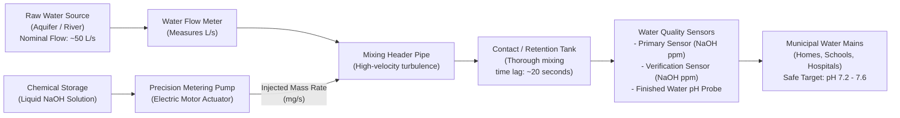
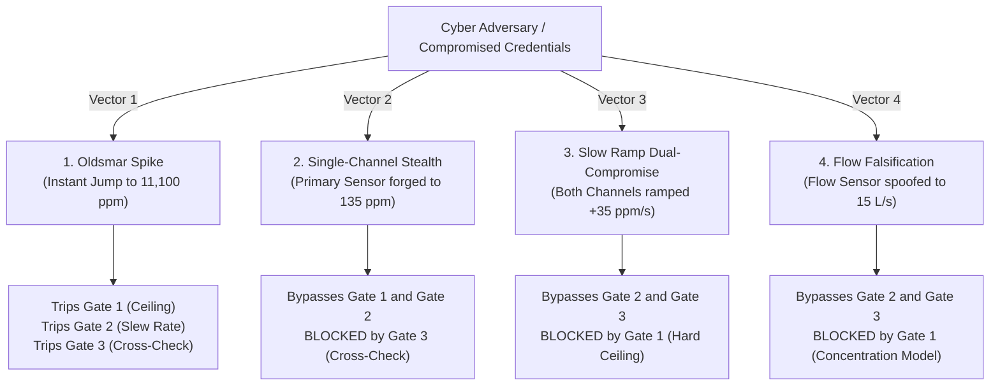
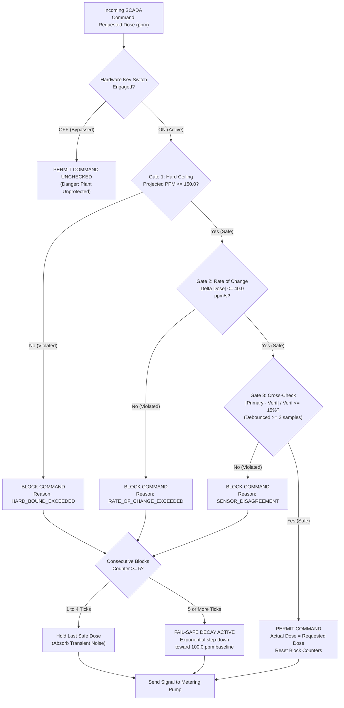
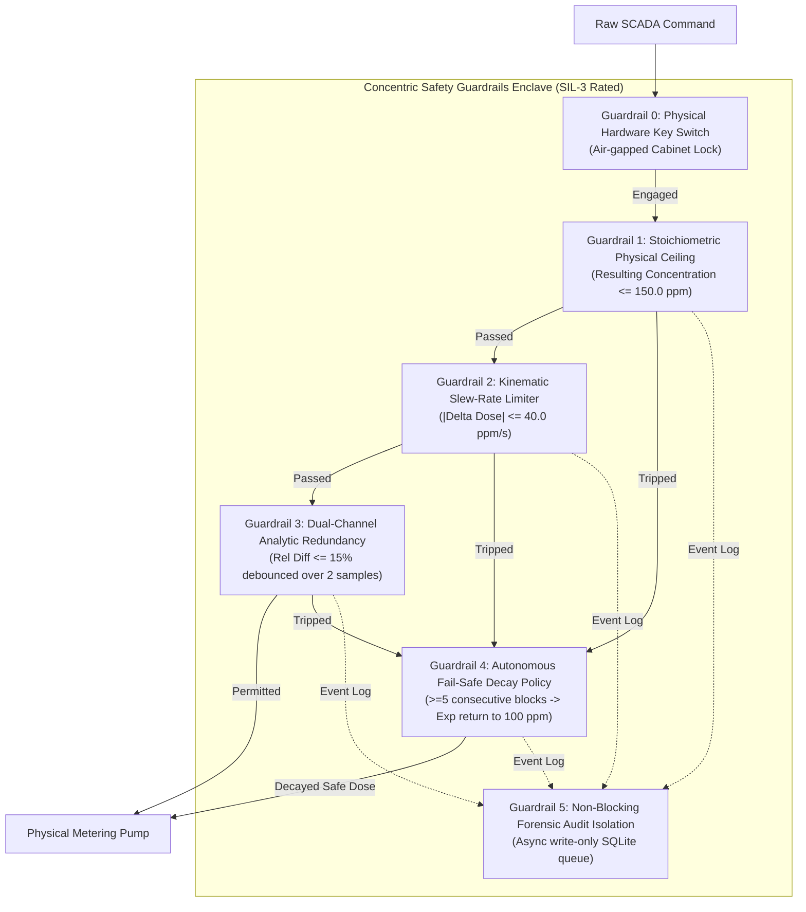
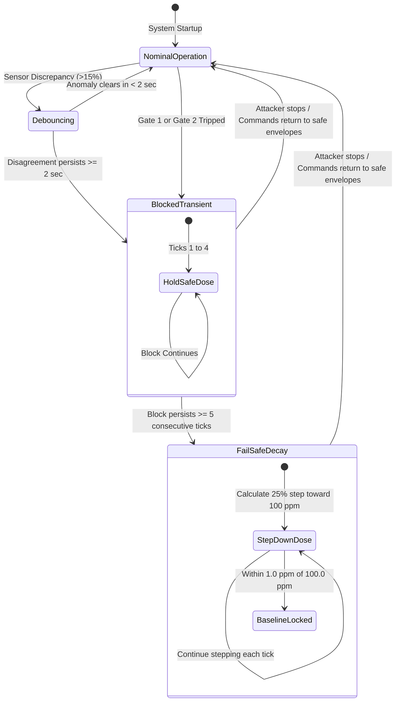

# The Complete Guide to the Oldsmar SCADA Safety System

> **A Plain-English Guide to Water Treatment, Cyberattacks, Industrial Safety, and the Math Behind the Code — Illustrated with Real-World Examples & Architecture Diagrams.**

---

## Table of Contents
1. [Introduction: What is this Project?](#1-introduction-what-is-this-project)
2. [How a Normal Water Treatment Plant Works](#2-how-a-normal-water-treatment-plant-works)
   - Real-World Analogy: Why we add Sodium Hydroxide ($NaOH$)
   - Plant Flow Diagram (Mermaid)
   - What is SCADA?
3. [The Real-World Threat: What Happened at Oldsmar?](#3-the-real-world-threat-what-happened-at-oldsmar)
   - Why traditional IT firewalls failed
   - The 4 Attack Vectors Explained with Concrete Examples
   - Attack Taxonomy Diagram (Mermaid)
4. [The Defense: Safety Instrumented System (SIS)](#4-the-defense-safety-instrumented-system-sis)
   - The "Defense-in-Depth" Philosophy
   - The 6 Defensive Guardrails Built into the System
   - Guardrail Defense Matrix
   - Gate Decision Flowchart (Mermaid)
   - Fail-Safe State Machine Diagram (Mermaid)
5. [The Equations Explained with Step-by-Step Examples](#5-the-equations-explained-with-step-by-step-examples)
   - Equation 1: Chemical Mass Injection ($ppm = \frac{\text{mass}}{\text{flow}}$) + Example
   - Equation 2: Contact Tank First-Order Mixing Lag + Numerical Second-by-Second Table
   - Equation 3: The pH Chemistry Titration Curve + Logarithmic Jump Walkthrough
   - Equation 4: The 3 Safety Gate Formulas with Worked Checks
   - Equation 5: The Fail-Safe Decay Step-Down Calculation
6. [How the Software is Implemented](#6-how-the-software-is-implemented)
   - 1-Second Control Loop Sequence Diagram (Mermaid)
   - The "Ghost Line" UI Telemetry Architecture
   - Asynchronous Write-Isolated SQLite Audit Sink
7. [Glossary of Key Terms](#7-glossary-of-key-terms)

---

## 1. Introduction: What is this Project?

Imagine turning on your kitchen tap to pour a glass of water. Instead of clean, refreshing water, out comes an odorless, clear liquid with a pH of **12.8**—as caustic as commercial liquid drain cleaner. A single swallow causes severe chemical burns to your mouth, esophagus, and stomach.

This is not science fiction. In February 2021, an unauthorized remote hacker breached the municipal water treatment facility in **Oldsmar, Florida** (a city of 15,000 residents near Tampa). The attacker manipulated the chemical feed of **sodium hydroxide ($NaOH$, commonly known as lye)**, commanding the plant to increase dosing from a normal **100 ppm** to a lethal **11,100 ppm**. 

The catastrophe was averted purely by chance: an alert plant operator happened to see their computer mouse cursor move across the screen on its own and manually reverted the command before the caustic fluid permeated the municipal distribution grid.

**This project is a high-fidelity cyber-physical simulator and defense system.** It proves two critical things:
1. **The Vulnerability:** How easily modern industrial infrastructure can be poisoned when basic computer software blindly trusts incoming commands.
2. **The Defense:** How an independent, physics-informed **Safety Instrumented System (SIS)** autonomously catches and neutralizes attacks in sub-second time—ensuring safe drinking water continues flowing without ever crashing the plant.

---

## 2. How a Normal Water Treatment Plant Works

### Real-World Analogy: Why do we put chemicals in drinking water?
Think of natural water drawn from lakes, underground aquifers, or rivers as slightly acidic rain. 

If acidic water flows through miles of aging city pipes, it acts like vinegar on metal: it eats away at lead solder and copper plumbing. This dissolves toxic heavy metals directly into the drinking supply (which is what caused the tragedy in Flint, Michigan).

To solve this, water treatment plants dose a tiny, strictly controlled amount of **Sodium Hydroxide ($NaOH$, or lye)**:
- **Lye is a strong base:** Adding a tiny pinch neutralizes acidity.
- **The Sweet Spot ($100\text{ ppm}$):** At approximately 100 parts per million, the water achieves a safe, slightly alkaline pH between **7.2 and 7.6**. It coats the inside of city pipes with a protective mineral layer and is 100% safe to drink.
- **The Danger Zone ($>1,000\text{ ppm}$):** If you add too much, the water exhausts its natural mineral buffer, and the pH skyrockets past 10.0 to 13.0+, transforming drinking water into caustic lye.

### Plant Flow Diagram



### What is SCADA?
**SCADA** (*Supervisory Control and Data Acquisition*) is the industrial computer network that acts as the **central nervous system** of modern infrastructure:
- **Sensors** are the eyes (measuring water flow rate and chemical concentration).
- **PLCs** (*Programmable Logic Controllers*) are the muscles (relays that physically spin electric motors and pumps).
- **The SCADA Server & HMI** (*Human-Machine Interface*) is the brain and screen where human operators monitor graphs, review alarms, and set targets.

---

## 3. The Real-World Threat: What Happened at Oldsmar?

### Why Traditional IT Firewalls Failed
Corporate IT security protects the perimeter using passwords, Virtual Private Networks (VPNs), and multi-factor authentication (2FA).

In the Oldsmar incident, the attacker accessed an operator's workstation using **TeamViewer** with compromised credentials. Once inside:
- To the firewall, the attacker looked like a trusted employee working from home.
- To the database, the API calls were valid.
- To the PLC, the command to inject `11,100 ppm` was a valid floating-point number.

The fundamental design failure was **blind trust**: the software assumed that because the command was signed by an authorized terminal, the physical request was safe.

---

### The 4 Attack Vectors Explained with Concrete Examples



#### Vector 1: The Oldsmar Spike (Raw Brutality)
* **What happens:** The attacker immediately overwrites the dosing setpoint from $100\text{ ppm}$ to $11,100\text{ ppm}$.
* **Real-World Analogy:** You are driving at 60 mph on the highway and instantly slam the gas pedal to 2,000 mph.
* **Why it fails:** It trips every alarm in the building: it violates the maximum concentration limit, breaks the speed limit of change, and creates a massive disagreement between sensor channels.

#### Vector 2: Single-Channel Stealth Attack (Subtle Deception)
* **What happens:** The attacker knows big spikes trigger alarms, so they manipulate only the Primary Sensor, pushing it moderately from $100\text{ ppm}$ up to $135\text{ ppm}$.
* **Real-World Analogy:** An attacker alters the thermometer on your thermostat by just 5 degrees so the heater gradually runs hotter without raising suspicion.
* **The Trap:** $135\text{ ppm}$ is below the $150\text{ ppm}$ ceiling, and the step is under the slew-rate limit.
* **How our defense catches it:** Our independent **Verification Channel** still reads $100\text{ ppm}$. The $35\%$ discrepancy immediately trips **Gate 3 (Sensor Cross-Check)**.

#### Vector 3: Slow Ramp Dual-Compromise (The Advanced Persistent Threat)
* **What happens:** A sophisticated adversary compromises **both** the Primary and Verification sensors simultaneously and slowly ramps them upward together at $+35\text{ ppm}$ every second.
* **Real-World Analogy:** The "boiling frog" scenario. The temperature climbs steadily so no single sudden jump ever looks abnormal.
* **The Trap:** Both sensors agree with each other ($0\%$ difference), and $+35\text{ ppm/s}$ is within the $\le 40\text{ ppm/s}$ rate limit.
* **How our defense catches it:** The moment the ramp crosses $150.1\text{ ppm}$, **Gate 1 (Hard Stoichiometric Ceiling)** shuts the door completely.

#### Vector 4: Flow Sensor Falsification (The Indirect Flank Attack)
* **What happens:** The attacker leaves all chemical sensors untouched at $100\text{ ppm}$. Instead, they hack the **water flow meter**, telling the computer that water flow has dropped from $50\text{ L/s}$ down to $15\text{ L/s}$.
* **The Trap:** The SCADA controller calculates chemical feed proportional to flow. Believing water is trickling, it alters pump dosing strokes.
* **How our defense catches it:** Our interlock does not merely monitor raw pump strokes; it computes **projected finished water concentration** ($ppm = \frac{mass}{flow}$). It detects that this combination creates a toxic concentration and blocks the command.

---

## 4. The Defense: Safety Instrumented System (SIS)

In accordance with international safety standards (**IEC 61511 / ISA-84**), safety logic must never be mixed with basic application software. Our SIS acts as an un-bypassable physical air-lock between SCADA and the pump hardware.

### Gate Decision Flowchart



---

### The "Defense-in-Depth" Philosophy
In real industrial engineering (governed by the international safety standard **IEC 61511 / ISA-84**), safety logic is strictly separated from basic computer control.

We implement an independent **Safety Instrumented System (SIS)**. Think of it as a physical co-pilot with its own set of immutable rules. Even if the main computer is infected or the human operator is hijacked, **every single command must pass through concentric safety guardrails before an electrical signal can reach the pump motor.**

---

### The 6 Defensive Guardrails Built into the System



---

#### Guardrail 1: The Stoichiometric Physical Ceiling ($\le 150.0\text{ ppm}$)
- **The Invariant:** Finished water concentration must never exceed $150.0\text{ ppm}$ of $NaOH$, regardless of what the operator clicks or what the raw water flow sensor reports.
- **Why $150.0\text{ ppm}$ is the Golden Boundary:**
  - Water chemistry contains a natural bicarbonate buffer ($\sim 2\text{ mEq/L}$). Below $150\text{ ppm}$, water remains buffered in the safe alkaline band ($\text{pH } 7.2 - 8.1$).
  - Once $NaOH$ surpasses $150–200\text{ ppm}$, the buffer is permanently exhausted. Free hydroxide ions ($OH^-$) surge, and the pH shoots up exponentially into the caustic danger zone ($>10.0$).
- **The Flow-Invariant Innovation:**
  - Most naive SCADA systems only check the *pump stroke percentage* (e.g. "is pump speed $\le 80\%$?").
  - If an attacker tampers with the water flow meter—reporting $15\text{ L/s}$ instead of $50\text{ L/s}$—a naive system would calculate a massive chemical injection rate to compensate, thinking water volume dropped.
  - Our guardrail calculates **Projected Concentration in the Finished Water Header**:
    $$C_{\text{projected}} = \text{Requested Dose} \times \frac{\text{Baseline Flow}}{\text{Actual Flow}}$$
    Because it models the physical water in the pipe rather than the motor voltage, it is **completely immune to flow sensor spoofing and dual-sensor compromises**.

---

#### Guardrail 2: The Kinematic Slew-Rate Limiter ($\le 40.0\text{ ppm/s}$)
- **The Invariant:** Chemical dosing commands cannot change faster than $40.0\text{ ppm}$ per second from the last accepted safe operating state.
- **Physical Rationale:**
  - Real municipal water treatment processes have massive physical inertia. Raw water quality (acidity, turbidity) shifts over hours as weather changes, never in 1-second step jumps.
  - Instantaneous multi-thousand ppm step changes cause **water hammer**, diaphragm pump cavitation, and severe electrical stress on motor windings.
- **Cyber-Defense Rationale:**
  - Immediately intercepts brute-force setpoint manipulation (like the Oldsmar spike).
  - Even if an attacker rapidly alternates commands between 0 and 1,000 ppm to induce mechanical resonance, the slew limiter clamps the derivative $\left|\frac{d\text{Dose}}{dt}\right| \le 40\text{ ppm/s}$, preventing oscillatory destruction.

---

#### Guardrail 3: Dual-Channel Analytic Redundancy & Temporal Debounce ($\le 15\%$, 2 Samples)
- **The Invariant:** The Primary SCADA Sensor channel and the independent Verification Sensor channel must match within $15\%$ relative tolerance.
- **Out-of-Band Hardware Isolation:**
  - The Verification Sensor is physically wired to the SIS and **cannot be modified, overridden, or written to by SCADA software**.
  - Even if an attacker gains root access to the SCADA server and forges the Primary Sensor telemetry to look completely normal, the Verification Sensor continues reporting ground truth.
- **The Temporal Debounce Filter (False Alarm Suppression):**
  - Industrial sensors generate acoustic noise, electrical ground hum, and micro-bubble interference. A single noisy reading could cause a false alarm.
  - Guardrail 3 enforces a **2-sample debounce threshold**: the disagreement must persist for $\ge 2$ consecutive seconds before tripping the safety block.
  - Because the hydraulic contact tank takes $\sim 20\text{ seconds}$ to mix, a 2-second debounce filter catches attacks with zero physical risk while eliminating nuisance trips.
- **Division-by-Zero Protection:**
  $$\text{Relative Difference} = \frac{|P - V|}{\max(|V|, 1.0)}$$
  The denominator is clamped to a minimum of $1.0\text{ ppm}$, preventing mathematical overflow if sensor readings momentarily approach zero.

---

#### Guardrail 4: Autonomous Fail-Safe Decay Policy (The Continuous Availability Guard)
- **The Invariant:** Under sustained attack or sensor failure, the plant must never shut down entirely, nor remain locked at an elevated operating point. It must automatically return to nominal $100.0\text{ ppm}$.
- **The Flaw of "Freezing Setpoints":**
  - Standard safety interlocks freeze the pump at the "last known good command."
  - **The Hazard:** If the plant was legitimately operating at an elevated dose of $140\text{ ppm}$ (near the safety ceiling) when the attack commenced, freezing leaves the plant operating with razor-thin safety margins for hours.
- **The Mechanism of Action:**
  - **Ticks 1 to 4:** Holds the last accepted safe dose to absorb transient anomalies without service disruption.
  - **Ticks 5+:** Automatically initiates an **exponential decay step**:
    $$\text{Decay Step} = (100.0 - \text{Last Dose}) \times 0.25$$
    $$\text{New Safe Dose} = \text{Last Dose} + \text{Decay Step}$$
  - **Snap-to-Baseline Rule:** Once $|\text{Last Dose} - 100.0| < 1.0\text{ ppm}$, the dose snaps cleanly to exactly $100.0\text{ ppm}$.
- **Municipal Benefit:** Keeps clean, safe water flowing to homes and fire hydrants without requiring emergency maintenance personnel to arrive on-site.

---

#### Guardrail 5: Physical Air-Gap / Hardware Key Switch Guardrail
- **The Invariant:** The Safety Instrumented System cannot be disabled through network packets, API calls, or software configuration.
- **Implementation in Code & Reality:**
  - In our dashboard, the ON/OFF switch represents a **physical, key-operated rotary switch on a locked NEMA 4X control cabinet** inside the water plant.
  - In an actual IEC 61511 deployment, the SIS logic solver runs on dedicated SIL-3 rated hardware (such as a Schneider Triconex or HIMA logic controller) that has no network connection to the SCADA server. Disabling the interlock requires physical presence, a metal key, and an on-duty supervisor.

---

#### Guardrail 6: Write-Only Non-Blocking Forensic Audit Sink
- **The Invariant:** High-frequency telemetry logging must never degrade real-time control deadlines, and audit records must be tamper-resistant.
- **Asynchronous Producer-Consumer Queue:**
  - The 1Hz control loop pushes decision records into an in-memory `asyncio.Queue`.
  - A separate worker thread handles SQLite disk writes. If disk I/O stalls, the water control loop executes precisely on its 1.00s deadline without micro-stutters.
- **Non-Repudiation for Regulators:**
  - All blocked attempts, tripped gates, and raw sensor values are stored in an append-only database (`data/audit.db`), providing immutable legal evidence for EPA, CISA, and FBI forensics.

---

### Guardrail Defense Matrix

| Cyberattack Vector | Guardrail 1: Hard Bound ($\le 150$) | Guardrail 2: Slew Rate ($\le 40$) | Guardrail 3: Cross-Check ($\le 15\%$) | Guardrail 4: Fail-Safe Decay | Final Plant Outcome |
|---|:---:|:---:|:---:|:---:|---|
| **1. Oldsmar Spike** (11,100 ppm) | **TRIPPED** | **TRIPPED** | **TRIPPED** | Active after 5s | **Blocked instantly.** Actual dose stays 100 ppm; pH locked at 7.60. |
| **2. Single-Channel Stealth** (135 ppm) | Bypassed ($\le 150$) | Bypassed ($\le 40$) | **TRIPPED** (35% diff) | Active after 5s | **Blocked on tick 2.** Caught exclusively by verification channel. |
| **3. Slow Ramp Dual** (+35 ppm/s) | **TRIPPED** (at 150.1 ppm) | Bypassed ($35 \le 40$) | Bypassed (0% diff) | Active after 5s | **Blocked by physical ceiling.** Defeats dual-sensor compromise. |
| **4. Flow Falsification** (15 L/s) | **TRIPPED** (Projected 333 ppm) | Bypassed | Bypassed | Active after 5s | **Blocked by concentration model.** Protects against flow spoofing. |

---

### Gate Decision Flowchart


---

### Fail-Safe State Machine Diagram



---

## 5. The Equations Explained with Step-by-Step Examples

Here is a full breakdown of every equation implemented in the project, illustrated with actual numbers.

---

### Equation 1: Chemical Mass Injection and Concentration

#### The Formulas:
$$\text{Chemical Feed Rate } (\text{mg/s}) = \text{Dose } (\text{ppm}) \times \text{Flow Rate } (\text{L/s})$$

$$\text{Resulting Concentration } (\text{ppm}) = \frac{\text{Chemical Feed Rate } (\text{mg/s})}{\text{Actual Flow Rate } (\text{L/s})}$$

#### Concrete Worked Example:
* Suppose water is flowing at **$50\text{ L/s}$** and the controller wants a target dose of **$100\text{ ppm}$** ($100\text{ mg/L}$):
  $$\text{Feed Rate} = 100\text{ mg/L} \times 50\text{ L/s} = \mathbf{5,000\text{ mg/s}} \quad (5\text{ grams of pure } NaOH\text{ per second})$$
* If an attacker falsifies the flow sensor to read **$15\text{ L/s}$**, a naive controller would think it needs to adjust dosing:
  $$\text{Target Dose} = 100 \times \left(\frac{50}{15}\right) = \mathbf{333.3\text{ ppm}}$$
* The interlock evaluates the projected resulting concentration:
  $$\text{Projected Concentration} = \mathbf{333.3\text{ ppm}} > 150.0\text{ ppm Limit} \implies \mathbf{BLOCKED!}$$

---

### Equation 2: Contact Tank First-Order Mixing Lag

In real fluids, chemicals injected into a pipe take time to mix thoroughly inside a large retention basin. The concentration inside the tank ($C_{\text{tank}}$) follows a **First-Order Differential Equation**:

$$\frac{dC_{\text{tank}}}{dt} = \frac{C_{\text{resulting}} - C_{\text{tank}}}{\tau}$$

Where:
- $\tau = 4.5\text{ seconds}$ is the hydraulic time constant.
- Full equilibrium takes $\sim 4$ to $5 \times \tau \approx \mathbf{20\text{ seconds}}$.

#### Discrete Implementation in Python (`app/plant.py`):
For a 1-second simulation step ($dt = 1.0\text{s}$):
$$\alpha = 1 - e^{-\frac{dt}{\tau}} = 1 - e^{-\frac{1.0}{4.5}} = 1 - e^{-0.2222} \approx \mathbf{0.1993} \quad (\approx 20\%)$$

$$C_{\text{tank}}^{\text{new}} = C_{\text{tank}}^{\text{old}} + \alpha \times \left( C_{\text{resulting}} - C_{\text{tank}}^{\text{old}} \right)$$

#### Second-by-Second Numerical Walkthrough (Unprotected Oldsmar Spike):
Watch how the tank concentration climbs toward $11,100\text{ ppm}$ when the interlock is bypassed:

| Second ($t$) | Incoming $C_{\text{resulting}}$ | Current Tank Concentration ($C_{\text{tank}}$) | Calculation Step ($\alpha \approx 0.20$) | Resulting Water pH | Band |
|---|---|---|---|---|---|
| **$0\text{s}$** | $100.0\text{ ppm}$ | **$100.0\text{ ppm}$** | Baseline nominal operation | $7.60$ | Safe (Green) |
| **$1\text{s}$** | $11,100.0\text{ ppm}$ | **$2,292.3\text{ ppm}$** | $100 + 0.1993 \times (11100 - 100)$ | $11.41$ | **Lethal Caustic** |
| **$2\text{s}$** | $11,100.0\text{ ppm}$ | **$4,047.8\text{ ppm}$** | $2292.3 + 0.1993 \times (11100 - 2292.3)$ | $12.10$ | **Lethal Caustic** |
| **$5\text{s}$** | $11,100.0\text{ ppm}$ | **$7,422.5\text{ ppm}$** | Continuous logarithmic mixing | $12.84$ | **Lethal Caustic** |
| **$20\text{s}$**| $11,100.0\text{ ppm}$ | **$11,098.2\text{ ppm}$**| Tank completely saturated with lye | $13.33$ | **Lethal Caustic** |

---

### Equation 3: The pH Chemistry Titration Curve

pH is the negative logarithm of hydrogen ion activity ($-\log_{10}[H^+]$).

Natural drinking water has an alkaline bicarbonate buffer ($\sim 2\text{ mEq/L}$). Our simulator models real titration chemistry:

```
Water pH
 ▲
14│                                                   * * * * * (pH 13.33 at 11,100 ppm)
12│                                       * * * * * *
10│                             * * * * *             [DANGEROUS CAUSTIC BAND: pH > 10.0]
 8│  - - - - - - - - * * * * * *                      [ELEVATED BAND: pH 8.5 - 10.0]
 7│═════════════════                                  [SAFE BAND: pH 6.5 - 8.5]
 6│ (Buffer Range)
  └──────────────────┬────────────────────┬─────────────────────►
  0                 100                  200                11,100   NaOH Concentration (ppm)
```

#### Regime A: Buffered Alkaline Neutralization ($C \le 100\text{ ppm}$)
$$\text{pH} = 7.2 + 0.4 \times \left( \frac{C}{100.0} \right)$$
* At $C = 100.0\text{ ppm}$:
  $$\text{pH} = 7.2 + 0.4 \times (1.0) = \mathbf{7.60} \quad \text{(Clean, crisp drinking water)}$$

#### Regime B: Logarithmic Caustic Dissociation ($C > 100\text{ ppm}$)
Once $NaOH$ exhausts the mineral buffer, unbonded hydroxide ions ($OH^-$) surge, causing logarithmic escalation:
$$\text{pH} = 7.6 + 2.8 \times \log_{10}\left( \frac{C}{100.0} \right)$$

* **At $150\text{ ppm}$ (Maximum Safety Limit):**
  $$\frac{150}{100} = 1.5 \implies \log_{10}(1.5) = 0.176$$
  $$\text{pH} = 7.6 + (2.8 \times 0.176) = 7.6 + 0.49 = \mathbf{8.09} \quad \text{(Safe drinking water)}$$

* **At $1,000\text{ ppm}$:**
  $$\frac{1000}{100} = 10 \implies \log_{10}(10) = 1.000$$
  $$\text{pH} = 7.6 + (2.8 \times 1.0) = \mathbf{10.40} \quad \text{(Irritant / Elevated Danger)}$$

* **At $11,100\text{ ppm}$ (The Oldsmar Cyberattack):**
  $$\frac{11100}{100} = 111 \implies \log_{10}(111) = 2.0453$$
  $$\text{pH} = 7.6 + (2.8 \times 2.0453) = 7.6 + 5.73 = \mathbf{13.33}$$
  *(Clamped by physical solubility saturation to a maximum of $13.50$)*.

---

### Equation 4: The 3 Safety Gate Formulas with Worked Checks

#### Check 1: Gate 3 Relative Disagreement Formula
$$\text{Relative Difference} = \frac{|P - V|}{\max(|V|, 1.0)}$$
* **Example:** Primary sensor reads $P = 135\text{ ppm}$, Verification reads $V = 100\text{ ppm}$:
  $$\text{Relative Difference} = \frac{|135 - 100|}{100} = \frac{35}{100} = \mathbf{0.35 \quad (35\%)}$$
  Since $35\% > 15\%$ tolerance, the disagreement counter increments. On sample 2, **Gate 3 blocks the command**.

#### Check 2: Gate 2 Slew Rate Formula
$$\Delta = | \text{Requested Dose} - \text{Last Accepted Dose} |$$
* **Example:** Last dose was $100\text{ ppm}$. Requested dose is $11,100\text{ ppm}$:
  $$\Delta = |11,100 - 100| = \mathbf{11,000\text{ ppm/s}}$$
  Since $11,000 > 40.0\text{ ppm/s}$, **Gate 2 blocks the command**.

---

### Equation 5: The Fail-Safe Decay Step-Down Calculation

When an attack triggers $5$ consecutive blocks, the interlock decays the dose by $25\%$ of the remaining distance to the $100.0\text{ ppm}$ baseline on each tick:

$$\text{Decay Step} = (100.0 - \text{Last Dose}) \times 0.25$$
$$\text{New Safe Dose} = \text{Last Dose} + \text{Decay Step}$$

#### Example Step-Down Sequence:
Suppose an attack hit while the plant was operating at an elevated state of **$140.0\text{ ppm}$**:
- **Tick 5 (Decay Starts):** $(100 - 140) \times 0.25 = -10.0\text{ ppm} \implies \mathbf{130.0\text{ ppm}}$
- **Tick 6:** $(100 - 130) \times 0.25 = -7.5\text{ ppm} \implies \mathbf{122.5\text{ ppm}}$
- **Tick 7:** $(100 - 122.5) \times 0.25 = -5.6\text{ ppm} \implies \mathbf{116.9\text{ ppm}}$
- **Tick 8:** $(100 - 116.9) \times 0.25 = -4.2\text{ ppm} \implies \mathbf{112.7\text{ ppm}}$
- Within ~12 seconds, it snaps cleanly to **$100.0\text{ ppm}$**.

---

## 6. How the Software is Implemented

### 1-Second Control Loop Sequence Diagram

```mermaid
sequenceDiagram
    autonumber
    actor Attacker as Cyber Adversary
    participant Sim as Plant Simulator (Physics)
    participant Loop as Plant Controller (1Hz Async Loop)
    participant SIS as Safety Interlock (IEC 61511)
    participant UI as Control Room Dashboard (app.js)
    participant DB as SQLite Forensic Sink (Audit.db)

    Note over Loop: 1.00s Timer Tick
    Loop->>Sim: read_sensors()
    Sim-->>Loop: Primary: 100 ppm, Verif: 100 ppm, Flow: 50 L/s
    
    opt Adversary Injects Attack
        Attacker->>Sim: inject_primary(11100 ppm)
    end
    
    Loop->>Loop: Calculate Requested Dose (11,100 ppm)
    Loop->>SIS: evaluate(requested_dose, primary, verif, flow)
    
    alt SIS Safety Gates Tripped
        SIS-->>Loop: Decision: BLOCKED, Safe Dose: 100 ppm, Reason: SENSOR_DISAGREEMENT
    else Nominal Tracking
        SIS-->>Loop: Decision: ALLOWED, Actual Dose: Requested Dose
    end
    
    Loop->>Sim: step(actual_dose=100 ppm, actual_flow=50 L/s, dt=1.0s)
    Note over Sim: Updates mixing header & tank lag differential eq
    
    Loop->>DB: async enqueue(DecisionRecord)
    Note over DB: Written by worker thread without blocking loop
    
    UI->>Loop: GET /state (every 500ms)
    Loop-->>UI: Telemetry JSON (Requested: 11,100 | Actual: 100 | pH: 7.60)
    Note over UI: Renders Red Ghost Line vs Solid Blue Line
```

---

### The "Ghost Line" UI Telemetry Architecture
The frontend visualization separates what the attacker wants from what the plant actually does:
- **The Red Dashed Line ("Ghost Line"):** Plotted directly from `requested_dose`. Under attack, it rockets straight to $11,100\text{ ppm}$.
- **The Solid Cyan Line:** Plotted directly from `actual_dose` (the physical pump actuator). It stays locked flat at $100\text{ ppm}$.
- **The Result:** Anyone looking at the monitor instantly sees the safety system absorbing the attack.

### Asynchronous Write-Isolated SQLite Audit Sink
In industrial cyber-defense, audit trails must never degrade real-time performance:
1. `controller.py` calls `audit.enqueue(record)`, which pushes data into an in-memory `asyncio.Queue`.
2. A separate background worker task (`AuditSink`) dequeues the record and writes to `data/audit.db`.
3. If disk I/O stalls or database locks occur, **the 1Hz water control loop never stutters**.
4. The database is append-only, providing cryptographic non-repudiation for incident investigations by government authorities (EPA, CISA, FBI).

---

## 7. Glossary of Key Terms

- **$NaOH$ (Sodium Hydroxide / Lye):** An inorganic, highly alkaline chemical compound used in water treatment to raise pH and prevent pipe corrosion.
- **PPM (Parts Per Million):** A measurement of chemical concentration in liquid. For water, $1\text{ ppm} = 1\text{ milligram per liter } (1\text{ mg/L})$.
- **pH:** A logarithmic scale (0–14) measuring the acidity or basicity of an aqueous solution. Pure water is $7.0$. Safe drinking water is between $6.5$ and $8.5$.
- **SCADA:** *Supervisory Control and Data Acquisition*. Industrial computer architecture used to monitor and manage municipal utilities.
- **PLC:** *Programmable Logic Controller*. A ruggedized, real-time industrial microcomputer responsible for physical output relays (turning motors and pumps).
- **SIS:** *Safety Instrumented System*. Dedicated, independent hardware and software engineered to monitor critical variables and automatically drive a process to a safe state upon hazard detection.
- **IEC 61511 / ISA-84:** The definitive international engineering standards specifying functional safety requirements for industrial Safety Instrumented Systems.
- **SIL-3:** *Safety Integrity Level 3*. A high standard of industrial safety reliability, requiring a probability of failure on demand between $10^{-4}$ and $10^{-3}$.
- **Slew Rate Limit:** A restriction that bounds how quickly a signal or physical command can change per unit of time (e.g., maximum $+40\text{ ppm/s}$).
- **Analytic Redundancy:** A technique comparing readings from two or more distinct physical sensor channels to detect drift, spoofing, or hardware failure without requiring identical hardware paths.
- **Fail-Safe:** A design paradigm where system failure or active cyberattack results in automatic fallback to a safe baseline state that preserves human life and equipment integrity.
